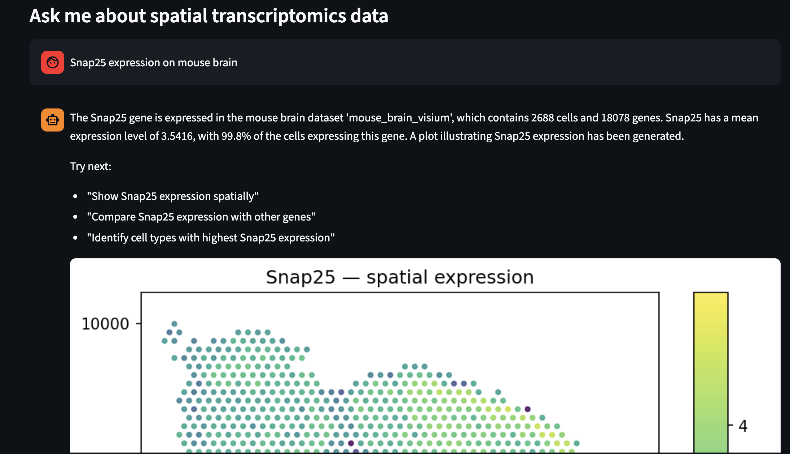

# SpatialChat

A natural language interface for spatial transcriptomics analysis, built on a **supervisor-routed multi-agent architecture** using [LangGraph](https://github.com/langchain-ai/langgraph). The frontend is a [Streamlit](https://streamlit.io/) web app, and all agent runs can be traced and debugged through [LangSmith](https://smith.langchain.com).

Ask questions like *"Show Snap25 expression in the mouse brain Visium dataset"* or *"Find genes with similar expression patterns to T"* and get back spatial plots, statistics, and interpretations through conversation.

<p align="center">
  
</p>

## Why This Exists

SpatialChat is designed as a **reference architecture** for building multi-agent systems with LangGraph.

The core pattern (supervisor routing to specialized sub-agents, each with their own tools and prompts) is general-purpose and extensible. Fork it, add your own sub-agents and do intricate analysis.

## What It Can Do

SpatialChat ships with four specialized sub-agents, each with their own toolset. A supervisor routes every user query to the right agent and synthesizes the results into a single response with embedded plots.

**Dataset discovery and loading.** Search available datasets by tissue, species, or technology. Load any h5ad file with spatial coordinates. Fuzzy gene name matching handles typos and case mismatches automatically. An LRU cache manages memory so multiple large datasets (1-5 GB each) can be swapped without crashing.

**RAG-powered gene discovery.** A ChromaDB vector database indexes gene expression statistics (mean, median, % expressing, per-celltype profiles) as numeric embeddings for each dataset. Agents can search for genes by biological description ("find markers of endothelium") or find genes with similar expression patterns using vector similarity search. This is retrieval-augmented generation applied to spatial transcriptomics.

**Spatial gene expression.** Plot any gene on tissue coordinates with a color-scaled scatter plot. Compare expression between two cell groups with a Mann-Whitney U test (p-value, log2 fold change, violin plot). View mean expression across all cell types as a ranked bar chart. Visualize spatial domains, clusters, or any categorical annotation on the tissue.

**Spatial statistics.** Compute Moran's I spatial autocorrelation for individual genes or find the top 10 most spatially variable genes across the dataset. Run co-occurrence analysis to see which cell types tend to appear near each other in tissue.

**Neighborhood analysis.** Test which cell type pairs are spatially enriched as neighbors (neighborhood enrichment). Compute a cell-cell contact frequency matrix showing how often each pair of types are direct spatial neighbors.

**Streamlit frontend.** Multi-turn chat with persistent conversation threads, a sidebar showing the currently loaded dataset and available catalog, inline plot rendering, and auto-generated follow-up suggestions after each answer.

## Quick Start

**1. Install with uv**

```bash
uv sync
```

Or with pip:

```bash
pip install -e .
```

**2. Configure environment**

```bash
cp .env.example .env
```

Edit `.env` with your API keys:

```
OPENAI_API_KEY=sk-...          # or ANTHROPIC_API_KEY=sk-ant-...
LANGCHAIN_API_KEY=lsv2_...     # optional, for LangSmith tracing
```

**3. Add data**

```bash
# Download the mouse brain seqFISH dataset (~31 MB)
uv run python -c "import squidpy as sq; adata = sq.datasets.seqfish(); adata.write_h5ad('data/anndata/seqfish.h5ad')"

# Download the mouse brain Visium dataset (~314 MB)
uv run python -c "import squidpy as sq; adata = sq.datasets.visium_hne_adata(); adata.write_h5ad('data/anndata/visium.h5ad')"
```

Or bring your own h5ad files (see the [Data Ingestion Guide](docs/ARCHITECTURE.md#data-ingestion-guide)).

**4. Build the vector index (for RAG) — do this before launching the app**

```bash
# Pre-build ChromaDB index for all datasets in the catalog
uv run python scripts/build_vector_index.py

# Or index a single dataset
uv run python scripts/build_vector_index.py --dataset-id mouse_brain_seqfish

# Re-index (e.g. after re-ingesting data)
uv run python scripts/build_vector_index.py --force
```

This computes per-gene expression statistics and indexes them as vector embeddings in ChromaDB. Building the index ahead of time is **strongly recommended** — it takes 30-60 seconds per dataset but only needs to be done once. If you skip this step, the app will auto-index on first dataset load, which makes the first query noticeably slow.

**5. Run**

```bash
uv run run-app
```

Or directly with streamlit:

```bash
uv run streamlit run app.py
```

LangGraph Studio (for development and debugging):

```bash
langgraph dev
```

## Testing

The test suite covers tool logic, data caching, catalog loading, routing, and full graph integration. Tests use synthetic AnnData fixtures so you don't need real data for unit tests.

```bash
# Run all unit tests (no API key needed)
uv run pytest tests/test_tools.py -v

# Run integration tests (requires an LLM API key in .env)
uv run pytest tests/test_graph.py -v

# Run everything
uv run pytest -v
```

Adding tests for new tools is straightforward: create a synthetic AnnData fixture, mock the cache, and assert on the JSON output. See `tests/test_tools.py` for examples covering PlotStore behavior, tool result formatting, gene validation (exact, case-insensitive, fuzzy), expression tool outputs, LRU cache eviction, and routing logic.

## Documentation

The documentation is split into focused guides:

- **[Architecture](docs/ARCHITECTURE.md)** covers the graph structure, design decisions, data layer, configuration, LangSmith tracing setup, and project layout.
- **[Extending SpatialChat](docs/EXTENDING.md)** is a step-by-step guide for adding new tools, creating new sub-agents, and wiring them into the graph.

## Included Datasets

| Dataset ID | Description | Cells | Genes | Technology |
|---|---|---|---|---|
| `mouse_brain_seqfish` | Mouse brain sub-ventricular zone | 19,416 | 351 | seqFISH |
| `mouse_brain_visium` | Mouse brain sagittal section | 2,688 | 18,078 | 10x Visium |

## Vector Database (RAG)

SpatialChat uses **ChromaDB** as an embedded vector database for retrieval-augmented generation over gene expression data. Each gene is embedded as a fixed-size vector built from its expression statistics: `[log1p(mean), log1p(median), pct_expressing, log1p(std), per_celltype_means...]`, L2-normalised for cosine similarity. This means genes with similar expression patterns across cell types cluster together in vector space.

The vector store is populated during dataset ingestion (`ingest_dataset.py`) or via a one-time migration script (`build_vector_index.py`). Three RAG tools are available to the exploratory agent:

- `rag_query_genes` — search genes by natural language description
- `rag_find_similar_genes` — find genes with similar expression profiles (vector similarity)
- `rag_query_celltypes` — search cell types and their marker genes

ChromaDB runs in embedded/persistent mode (no separate server). JSON metadata files are kept as a fallback.